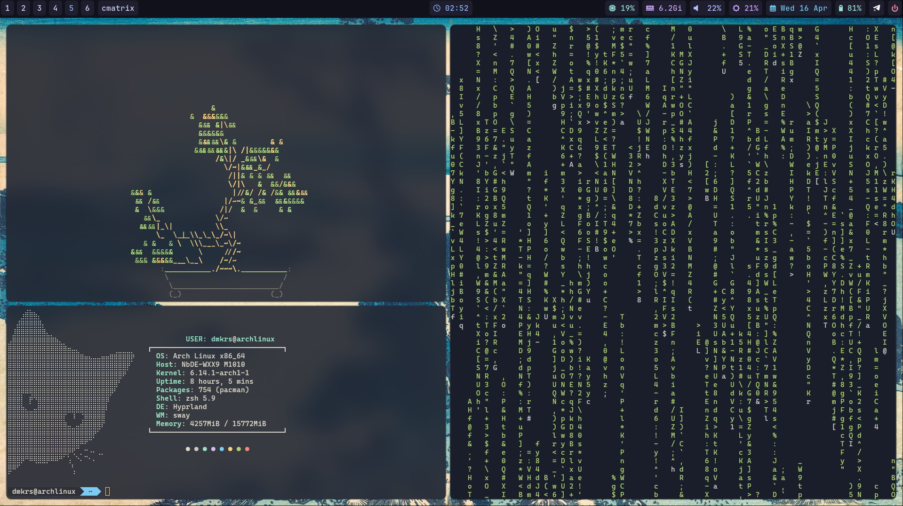

# hyprland dotfiles

In case my system collapses

For those who want to install for themselves, the screenshots are below

Maybe I'll write out all the dependencies and installation later

I took waybar and wofi from other repositories and adapted them for myself, I don't remember which ones, too lazy to look for them, since the repository is primarily intended for personal use

